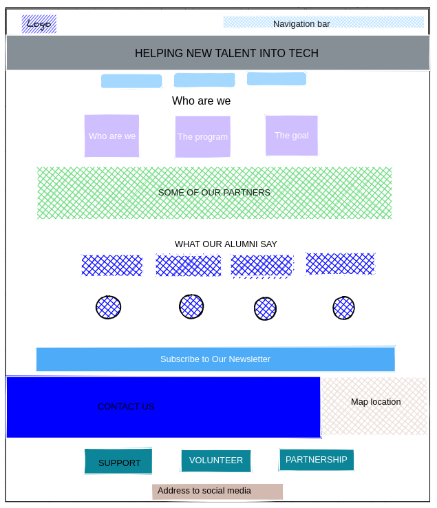

# Design

## Project's Design Overview

Our project focuses on rebuilding the website for HackYourFuture Belgium, an
international chapter of the HackYourFuture initiative initially founded in 2015
in Amsterdam. The aim of HackYourFuture is to enable refugees and disadvantaged
individuals to build digital skills for a career in web development, facilitate
the integration of newcomers, and address the shortage of qualified workforce in
the IT sector.

In redesigning the website, our primary objective is to create a user-friendly
platform that effectively communicates the mission and values of HackYourFuture
Belgium. We aim to enhance accessibility, improve navigation, and provide clear
pathways for users to access relevant resources and information about the
program.

To achieve these goals, we have prioritized a clean and modern design aesthetic,
with an emphasis on simplicity and clarity. Our design decisions are guided by
the principles of inclusivity, ensuring that the website is accessible to all
users, regardless of their background or abilities.

Additionally, we have carefully selected fonts, color palettes, and other design
elements that reflect the HackYourFuture brand identity while aligning with the
broader objectives of the organization.

---

## Wireframe(s)

