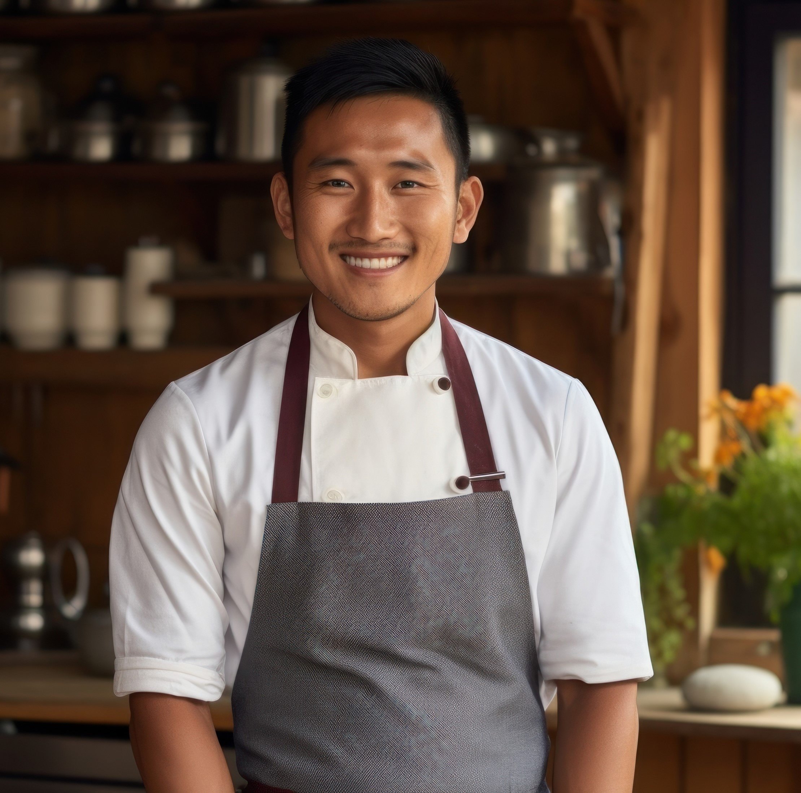

# User Personas

Website for a program designed to help refugees and immigrants to join and
become professionals in the IT field.

---

## HR-officer

- **Bio**: Lara, 55, works as a HR-officer for a new Belgian IT company.
- **Needs/Goals**: Needs a connection to find a lot of junior developers.
- **Frustrations**: Difficult to find qualified people.
- **Scenario 1**: Lara has been tasked to find new talented developers to join
  the ranks within the company.

---

## Baker

- **Bio**: Filip, 45, professionally trained baker currently unemployed cannot
  find work in his field. He moved to Belgium recently with his family to live a
  better life.
- **Needs/Goals**: Wants to retrain himself to a profession that has more work
  opportunities.
- **Frustrations**: Cannot find a training in English.
- **Scenario 1**: Needs to find a job to support his family, but he doesn't
  speak the local language. All the trainings are in Dutch in his area. Wants to
  go into coding because always found computers interesting.

---

## Refugee

- **Bio**: Fatma, 20, she came to Belgium as a refugee. She has no family to
  support her.
- **Needs/Goals**: Wants to find a good job and support herself.
- **Frustrations**: Issues finding a training without knowing the local
  language.
- **Scenario 1**: She wants to use her smart brain to find a good respected job
  in IT field.
